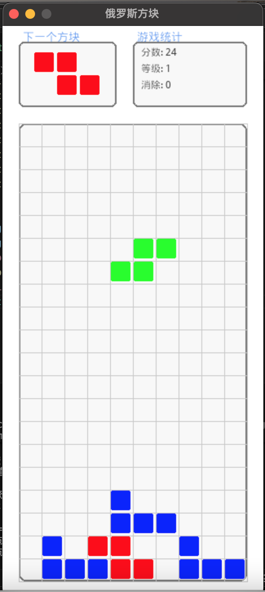

# tetris_colorful_game
In this demo, I will use python to create a tetris game, when i was young, the tetris game may be the first electric hands game in my memory

## Features

- the app looks like



## Usage

- Clone this  project
```shelll
git clone https://github.com/pengchao2022/tetris_colorful_game.git
```
- Install the pygame module
```shell
pip install pygame --break-system-packages
```

- RUN this game
```shell
python3 main.py
```

## Control Reference

- **⬆** -- switch the shape
- **⬅** -- move to left  
- **➡️** -- move to right
- **⬇** -- quickly down
- **M** -- turn on /off the music
- **R** -- Restart the game
- **ESC** -- Exit the game